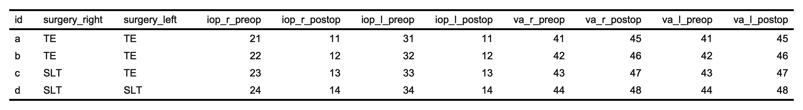

eye
================

<!-- README.md is generated from README.Rmd. Please edit that file -->
<!-- badges: start -->
<!-- [](https://www.travis-ci.com/tjebo/eye) -->
<!-- badges: end -->

See more with *eye*

## Purpose

*eye* is dedicated to facilitate very common tasks in ophthalmic
research.

## Features

-   [Handling of visual acuity notations](#visual-acuity)
-   [Super easy count of subjects and eyes](#count-subjects-and-eyes),
    with smooth integration in your rmarkdown report
-   [Recode your eye variable](#recoding-the-eye-variable)
-   Reshape your eye data - [long](#myop) or [wide](#hyperop)
-   [Quick summary of your eye data](#blink)
-   [Get common summary statistics](#reveal)
-   [Calculate age](#getage)
-   [Clean NA equivalent entries](#clean-na-entries)

## Installation

You can install eye [from CRAN](https://CRAN.R-project.org/package=eye)
using `install.packages("eye")`

Or you can install the development version from github:

    # install.packages("devtools")
    devtools::install_github("tjebo/eye")

I recommend to also get [eyedata](https://github.com/tjebo/eyedata/), a
package collating open source ophthalmic data sets.

## Details and examples

### Visual acuity

Pesky visual acuity notations are now a matter of the past. Convert
between any of Snellen (meter/ feet/ decimal!), logMAR and ETDRS. The
notation will be detected automatically and converted to the desired
notation. For some more details see [VA conversion](#va-conversion). For
entries with mixed notation, use `va_mixed` instead.

You can also decide to simply “clean” your VA vector with `cleanVA(x)`.
This will remove all entries that are certainly no VA.

#### Examples

``` r
x <- c(23, 56, 74, 58) ## ETDRS letters
to_logmar(x) # wrapper of va(x, to = "logmar")
#> From etdrs
#> [1] 1.24 0.58 0.22 0.54

## ... or convert to snellen
to_snellen(x) 
#> From etdrs
#> [1] "20/320" "20/80"  "20/32"  "20/70"

## eye knows metric as well 
to_snellen(x, type = "m") 
#> From etdrs
#> [1] "6/96"  "6/24"  "6/9.6" "6/21"

## And the decimal snellen notation, so much loved in Germany
to_snellen(x, type = "dec") 
#> From etdrs
#> [1] "0.062" "0.25"  "0.625" "0.3"

## Remove weird entries and implausible entries depending on the VA choice
x <- c("NLP", "0.8", "34", "3/60", "2/200", "20/50", "  ", ".", "-", "NULL")

to_snellen(x)
#> From snellen. Could be snellen, logmar, snellendec, etdrs
#> 6x NA introduced for: 0.8, 34,   , ., -, NULL
#>  [1] "20/20000" NA         NA         "20/400"   "20/2000"  "20/50"   
#>  [7] NA         NA         NA         NA
to_snellen(x, from = "snellendec")
#> 8x NA introduced for: 34, 3/60, 2/200, 20/50,   , ., -, NULL
#>  [1] "20/20000" "20/25"    NA         NA         NA         NA        
#>  [7] NA         NA         NA         NA
to_snellen(x, from = "etdrs")
#> 8x NA introduced for: 0.8, 3/60, 2/200, 20/50,   , ., -, NULL
#>  [1] "20/20000" NA         "20/200"   NA         NA         NA        
#>  [7] NA         NA         NA         NA
to_snellen(x, from = "logmar")
#> 8x NA introduced for: 34, 3/60, 2/200, 20/50,   , ., -, NULL
#>  [1] "20/20000" "20/125"   NA         NA         NA         NA        
#>  [7] NA         NA         NA         NA

## "plus/minus" entries are converted to the most probable threshold (any spaces allowed) 
x <- c("20/200 - 1", "6/6-2", "20/50 + 3", "6/6-4", "20/33 + 4")
to_logmar(x)
#> From snellen
#> [1] 1.0 0.0 0.3 0.1 0.1

## or evaluating them as logmar values (each optotype equals 0.02 logmar)
to_logmar(x, smallstep = TRUE)
#> From snellen
#> [1] 1.02 0.04 0.34 0.08 0.14

## or you can also decide to completely ignore them (converting them to the nearest snellen value in the VA chart, or if you convert to logMAR, rounding to the first digit)
to_snellen(x, noplus = TRUE)
#> From snellen
#> [1] "20/200" "20/20"  "20/50"  "20/20"  "20/32"

# terribly mixed notations
x <- c(NA, "nlp", 1:2, 1.1, -1, "20/40", "4/6", "6/1000", 34)
va_mixed(x, to = "snellen")
#>  [1] NA         "20/20000" "20/2000"  "20/2000"  "20/250"   NA        
#>  [7] "20/40"    "20/32"    "20/4000"  "20/200"

# "I only have snellen and snellen decimal notation in my data"
va_mixed(x, to = "snellen", possible = c("snellen", "snellendec"))
#>  [1] NA         "20/20000" "20/20"    "20/10"    "20/20"    NA        
#>  [7] "20/40"    "20/32"    "20/4000"  NA

# "I have snellen, logmar and etdrs in my data, and there is no etdrs value less than 4"
va_mixed(x, to = "snellen", possible = c("snellen", "logmar", "etdrs"))
#>  [1] NA         "20/20000" "20/200"   "20/2000"  "20/250"   NA        
#>  [7] "20/40"    "20/32"    "20/4000"  "20/200"
```

### Count subjects and eyes

This is a massive convenience function to count subjects and eyes.
Because this essentially returns a list, the stored data can easily be
accessed by subsetting (e.g., with `$`). You can get the subject IDs for
each subset with `details = TRUE`.

``` r
library(eyedata)
eyes(amd2)
#> ══ Counts ═══════════════
#>    id  eyes right  left 
#>  3357  3357  1681  1676

eyes(amd2)$right
#> [1] 1681

eyes(amd2, details = TRUE)
#> ══ $counts ══════════════════════════════════
#>    id  eyes right  left  both 
#>  3357  3357  1681  1676     0 
#> 
#> ══ $id ══════════════════════════════════════
#> $right
#> [1] "id_100"  "id_1001" "id_1002" "id_1003" "id_1007" "id_1009"
#> # … with 1675 more subjects
#> 
#> $left
#> [1] "id_1"    "id_10"   "id_1000" "id_1004" "id_1005" "id_1006"
#> # … with 1670 more subjects
#> 
#> $both
#> character(0)

head(eyes(amd2, details = TRUE)$id$right)
#> [1] "id_100"  "id_1001" "id_1002" "id_1003" "id_1007" "id_1009"
```

#### Smooth integration into rmarkdown

`eyestr` was designed with the use in rmarkdown in mind, most explicitly
for the use inline. You can change the way numbers are converted to
english with the `english` argument. By default, numbers smaller than or
equal to 12 will be real English, all other numbers will be … numbers.
You can capitalise the first number with the `caps` argument.

| rmarkdown code                                                  | results in                                                                                                             |
|-----------------------------------------------------------------|------------------------------------------------------------------------------------------------------------------------|
| We analyzed `` `r eyestr(amd2)` ``                              | We analyzed 3357 eyes of 3357 patients                                                                                 |
| We analyzed `` `r eyestr(head(amd2, 100))` ``                   | We analyzed eleven eyes of eleven patients                                                                             |
| We analyzed `` `r eyestr(amd2, english = "all")` ``             | We analyzed three thousand three hundred and fifty-seven eyes of three thousand three hundred and fifty-seven patients |
| `` `r eyestr(head(amd2, 100), caps = TRUE)` `` were analyzed    | Eleven eyes of eleven patients were analyzed                                                                           |
| We analyzed `` `r eyestr(head(amd2, 100), english = "none")` `` | We analyzed 11 eyes of 11 patients                                                                                     |

### Recoding the eye variable

Makes recoding eye variables very easy. It deals with weird missing
entries like `"."` and `""`, or `"N/A"`

``` r
x <- c("r", "re", "od", "right", "l", "le", "os", "left", "both", "ou")
recodeye(x)
#>  [1] "r" "r" "r" "r" "l" "l" "l" "l" "b" "b"

## chose the resulting codes
recodeye(x, to = c("od", "os", "ou"))
#>  [1] "od" "od" "od" "od" "os" "os" "os" "os" "ou" "ou"

## Numeric codes 0:1/ 1:2 are recognized 
x <- 1:2
recodeye(x)
#> Eyes coded 1:2. Interpreting r = 1
#> [1] "r" "l"

## with weird missing values
x <- c(1:2, ".", NA, "", "    ")
recodeye(x)
#> Missing values and/or meaningless strings contained
#> Eyes coded 1:2. Interpreting r = 1
#> [1] "r" "l" NA  NA  NA  NA

## If you are using different strings to code for eyes, e.g., you are using a different language, you can change this either with the "eyestrings" argument
french <- c("OD", "droit", "gauche", "OG")
recodeye(french, eyestrings = list(r = c("droit", "od"), l = c("gauche", "og")))
#> [1] "r" "r" "l" "l"

## or change it more globally with `set_eye_strings`
set_eye_strings(right = c("droit", "od"), left = c("gauche", "og"))
recodeye(french)
#> [1] "r" "r" "l" "l"

# to restore the default, call set_eye_strings empty
set_eye_strings()
```

### Clean NA entries

``` r
x <- c("a", "   ", ".", "-", "NULL")
tidyNA(x)
#> [1] "a" NA  NA  NA  NA

# in addition to the default strings, a new string can be added
tidyNA(x, string = "a")
#> [1] NA NA NA NA NA

# or just remove the strings you want
tidyNA(x, string = "a", defaultstrings = FALSE)
#> [1] NA     "   "  "."    "-"    "NULL"
```

### reveal

Show common statistics for all numeric columns, for the entire cohort or
aggregated by group(s):

``` r
reveal(iris)
#>            var mean  sd   n min max
#> 1 Sepal.Length  5.8 0.8 150 4.3 7.9
#> 2  Sepal.Width  3.1 0.4 150 2.0 4.4
#> 3 Petal.Length  3.8 1.8 150 1.0 6.9
#> 4  Petal.Width  1.2 0.8 150 0.1 2.5
#> 5      Species  2.0 0.8 150 1.0 3.0

reveal(iris, by = "Species") #can be several groups
#>       Species          var mean  sd  n min max
#> 1      setosa Sepal.Length  5.0 0.4 50 4.3 5.8
#> 2      setosa  Sepal.Width  3.4 0.4 50 2.3 4.4
#> 3      setosa Petal.Length  1.5 0.2 50 1.0 1.9
#> 4      setosa  Petal.Width  0.2 0.1 50 0.1 0.6
#> 5  versicolor Sepal.Length  5.9 0.5 50 4.9 7.0
#> 6  versicolor  Sepal.Width  2.8 0.3 50 2.0 3.4
#> 7  versicolor Petal.Length  4.3 0.5 50 3.0 5.1
#> 8  versicolor  Petal.Width  1.3 0.2 50 1.0 1.8
#> 9   virginica Sepal.Length  6.6 0.6 50 4.9 7.9
#> 10  virginica  Sepal.Width  3.0 0.3 50 2.2 3.8
#> 11  virginica Petal.Length  5.6 0.6 50 4.5 6.9
#> 12  virginica  Petal.Width  2.0 0.3 50 1.4 2.5
```

### getage

-   Calculate age in years, as [periods or
    durations](https://lubridate.tidyverse.org/articles/lubridate.html#time-intervals)

``` r
dob <- c("1984-10-16", "2000-01-01")

## If no second date given, the age today
getage(dob)
#> [1] 36.9 21.7
getage(dob, "2000-01-01")                                                    
#> [1] 15.2  0.0
```

### myop

Often enough, there are right eye / left eye columns for more than one
variable, e.g., for both IOP and VA. This may be a necessary data formal
for specific questions. However, “eye” is also variable (a dimension of
your observation), and it can also be stored in a separate column. The
data would be “longer.”

Indeed, R requires exactly this data shape for many tasks: “eye\[r/l\]”
as a separate column, and each eye-related variable (e.g., IOP or VA) in
their own dedicated column.

`myop` provides an easy to use API for an automatic reshape of your data
to a “myop” format.

``` r
## Simple data frame with one column for right eye and left eye.
iop_wide <- data.frame(id = letters[1:3], iop_r = 11:13, iop_l = 14:16)
iop_wide
#>   id iop_r iop_l
#> 1  a    11    14
#> 2  b    12    15
#> 3  c    13    16
```

``` r
myop(iop_wide)
#> # A tibble: 6 × 3
#>   id    eye   iop  
#>   <chr> <chr> <chr>
#> 1 a     right 11   
#> 2 a     left  14   
#> 3 b     right 12   
#> 4 b     left  15   
#> 5 c     right 13   
#> 6 c     left  16
```

Or another example with many more variables:
<details>
<summary>
Click to unfold code to create `wide_df`
</summary>

``` r
wide_df <- data.frame(
  id = letters[1:4], 
  surgery_right = c("TE", "TE", "SLT", "SLT"),
  surgery_left = c("TE", "TE", "TE", "SLT"),
  iop_r_preop = 21:24, iop_r_postop = 11:14,
  iop_l_preop = 31:34, iop_l_postop = 11:14, 
  va_r_preop = 41:44, va_r_postop = 45:48,
  va_l_preop = 41:44, va_l_postop = 45:48
)
```

</details>



``` r
myop_df <- myop(wide_df)

myop_df
#> # A tibble: 8 × 7
#>   id    eye   surgery iop_preop iop_postop va_preop va_postop
#>   <chr> <chr> <chr>   <chr>     <chr>      <chr>    <chr>    
#> 1 a     right TE      21        11         41       45       
#> 2 a     left  TE      31        11         41       45       
#> 3 b     right TE      22        12         42       46       
#> 4 b     left  TE      32        12         42       46       
#> 5 c     right SLT     23        13         43       47       
#> 6 c     left  TE      33        13         43       47       
#> 7 d     right SLT     24        14         44       48       
#> 8 d     left  SLT     34        14         44       48
```

### hyperop

If you actually need certain eye-related variables spread over two
columns, `hyperop()` is your friend:

``` r
hyperop(myop(iop_wide), iop)
#> # A tibble: 3 × 3
#>   id    r_iop l_iop
#>   <chr> <chr> <chr>
#> 1 a     11    14   
#> 2 b     12    15   
#> 3 c     13    16

hyperop(myop_df, cols = matches("va|iop"))
#> # A tibble: 5 × 10
#>   id    surgery r_iop_preop r_iop_postop r_va_preop r_va_postop l_iop_preop
#>   <chr> <chr>   <chr>       <chr>        <chr>      <chr>       <chr>      
#> 1 a     TE      21          11           41         45          31         
#> 2 b     TE      22          12           42         46          32         
#> 3 c     SLT     23          13           43         47          <NA>       
#> 4 c     TE      <NA>        <NA>         <NA>       <NA>        33         
#> 5 d     SLT     24          14           44         48          34         
#> # … with 3 more variables: l_iop_postop <chr>, l_va_preop <chr>,
#> #   l_va_postop <chr>
```

### blink

See your data in a blink of an eye - wrapper around [`myop`](#myop),
[`eyes`](#eyes), [`va`](#va) and [`reveal`](#reveal). It will look for
VA and for IOP columns and provide the summary stats for the entire
cohort and for right and left eyes for each variable.

[**This requires a certain format of your names and
codes**](#names-and-codes)

``` r
blink(wide_df)
```

## Names and codes

**eye works smoother with tidy data** (any package does, really!)

An important part of tidy data are good names. [Learn more about tidy
data.](https://tidyr.tidyverse.org/articles/tidy-data.html)

### Tips and rules for naming:

1.  Don’t be too creative with your names!
2.  Use common coding:

-   **eyes**: “r,” “re,” “od,” “right” - or numeric coding r:l = 0:1 or
    1:2
-   **Visual acuity**: “VA,” “BCVA,” “Acuity”
-   **Intraocular pressure**: “IOP,” “GAT,” “NCT,” “pressure”
-   **Patient identifier**: “pat,” “patient,” “ID” (ideally both:
    “patientID” or “patID”)

3.  Column names:

-   No spaces!
-   Do not use numeric coding for eyes in column names
-   Separate eye and VA and IOP codes with underscores
    (“bcva\_l\_preop,” “VA\_r,” “left\_va,” “IOP\_re”)
-   Keep names short
-   Don’t use underscores when you don’t need to: Consider each section
    divided by an underscore as a relevant characteristic of your
    variable. E.g., “preop” instead of “pre\_op,” or simply “VA” instead
    of “VA\_ETDRS\_Letters”

### Name examples

Good names (`eye` will work nicely)

``` r
## right and left eyes have common codes
## information on the tested dimension is included ("iop")
## VA and eye strings are separated by underscores
## No unnecessary underscores.
names(wide_df)
#>  [1] "id"            "surgery_right" "surgery_left"  "iop_r_preop"  
#>  [5] "iop_r_postop"  "iop_l_preop"   "iop_l_postop"  "va_r_preop"   
#>  [9] "va_r_postop"   "va_l_preop"    "va_l_postop"

names(iop_wide) 
#> [1] "id"    "iop_r" "iop_l"
```

OK names (`eye` will work)

``` r
## Id and Eye are common names, there are no spaces
## VA is separated from the rest with an underscore
## BUT: 
## The names are quite long 
## There is an unnecessary underscore (etdrs are always letters). Better just "VA"
c("Id", "Eye", "FollowupDays", "BaselineAge", "Gender", "VA_ETDRS_Letters", 
"InjectionNumber")
#> [1] "Id"               "Eye"              "FollowupDays"     "BaselineAge"     
#> [5] "Gender"           "VA_ETDRS_Letters" "InjectionNumber"

## All names are commonly used (good!)
## But which dimension of "r"/"l" are we exactly looking at? 
c("id", "r",  "l")
#> [1] "id" "r"  "l"
```

Bad names (`eye` will fail)

``` r
## VA/IOP not separated with underscore
## `eye` won't be able to recognize IOP and VA columns
c("id", "iopr", "iopl", "VAr", "VAl")
#> [1] "id"   "iopr" "iopl" "VAr"  "VAl"

## A human may think this is clear
## But `eye` will fail to understand those variable names
c("person", "goldmann", "vision")
#> [1] "person"   "goldmann" "vision"

## Not even clear to humans
c("var1", "var2", "var3")
#> [1] "var1" "var2" "var3"
```

### How do I rename columns in R?

When I started with R, I found it challenging to rename columns and I
found the following threads on stackoverflow very helpful:

-   [Rename single column](https://stackoverflow.com/q/7531868/7941188)
-   [Rename columns with named
    vector](https://stackoverflow.com/q/20987295/7941188)

I find the two following methods straight forward:

``` r
# I've got a data frame with unfortunate names:
name_mess <- data.frame(name = "a", oculus = "r", eyepressure = 14, vision = 0.2)
names(name_mess)
#> [1] "name"        "oculus"      "eyepressure" "vision"

## rename all names
names(name_mess) <- c("patID", "eye", "IOP", "VA")
names(name_mess)
#> [1] "patID" "eye"   "IOP"   "VA"
```

``` r
## To rename only specific columns, even if you are not sure about their exact position:
names(name_mess)[names(name_mess) %in% c("name", "vision")] <- c("patID", "VA")
names(name_mess)
#> [1] "patID"       "oculus"      "eyepressure" "VA"
```

## Important notes

**I do not assume responsability for your data or analysis**. Please
always keep a critical mind when working with data - if you do get
results that seem implausible, there may be a chance that the data is in
an unfortunate shape for which `eye` may not be suitable.

## VA conversion

-   VA conversion between Snellen, ETDRS and logMAR is based on charts
    and formulas in ([Holladay 2004](#ref-holladay)), ([Beck et al.
    2003](#ref-beck)) and ([Gregori, Feuer, and Rosenfeld
    2010](#ref-gregori))
-   Categories **counting fingers** and **hand movements** are converted
    following ([Schulze-Bonsel et al. 2006](#ref-bach))
-   Categories **(no) light perception** are converted following the
    suggestions by Michael Bach

## Acknowledgements

-   Thanks to **Alasdair Warwick**, **Aaron Lee**, **Tim Yap**,
    **Siegfried Wagner** and **Abraham Olvera** for great suggestions,
    testing and code review.  
-   **Pearse Keane**, **Dun Jack Fu**, **Katrin Fasler** and **Christoph
    Kern** for their contribution of open source data
-   Thanks to [Antoine Fabri](https://github.com/moodymudskipper) for
    his contribution to `getage()`
-   Thanks to Hadley Wickham and all developers of the `tidyverse`
    packages and the packages `roxygen2`, `usethis`, `testthis` and
    `devtools`, all on which `eye` heavily relies.

## Resources

-   [Michael Bach’s homepage](https://michaelbach.de/sci/acuity.html)
-   [Michael Bach on NLP and
    LP](https://michaelbach.de/sci/pubs/Bach2007IOVS_eLetter_FrACT.pdf)

## References

<div id="refs" class="references csl-bib-body hanging-indent">

<div id="ref-beck" class="csl-entry">

Beck, Roy W, Pamela S Moke, Andrew H Turpin, Frederick L Ferris, John
Paul SanGiovanni, Chris A Johnson, Eileen E Birch, et al. 2003. “A
Computerized Method of Visual Acuity Testing.” *American Journal of
Ophthalmology* 135 (2): 194–205.
<https://doi.org/10.1016/s0002-9394(02)01825-1>.

</div>

<div id="ref-gregori" class="csl-entry">

Gregori, Ninel Z, William Feuer, and Philip J Rosenfeld. 2010. “Novel
Method for Analyzing Snellen Visual Acuity Measurements.” *Retina* 30
(7): 1046–50. <https://doi.org/10.1097/iae.0b013e3181d87e04>.

</div>

<div id="ref-holladay" class="csl-entry">

Holladay, Jack T. 2004. “Visual Acuity Measurements.” *Journal of
Cataract and Refractive Surgery* 30 (February): 287–90.
<https://doi.org/10.1016/j.jcrs.2004.01.014>.

</div>

<div id="ref-bach" class="csl-entry">

Schulze-Bonsel, Kilian, Nicolas Feltgen, Hermann Burau, Lutz Hansen, and
Michael Bach. 2006. “<span class="nocase">Visual Acuities ‘Hand Motion’
and ‘Counting Fingers’ Can Be Quantified with the Freiburg Visual Acuity
Test</span>.” *Investigative Ophthalmology & Visual Science* 47 (3):
1236–40. <https://doi.org/10.1167/iovs.05-0981>.

</div>

</div>
