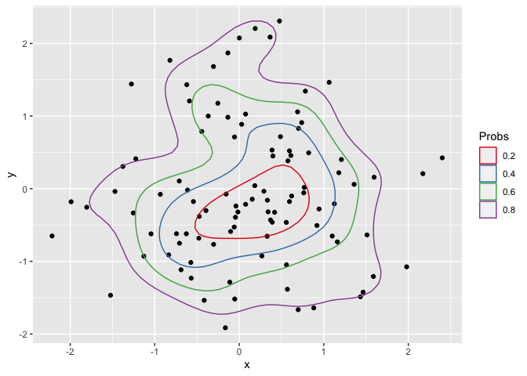

eye
================

<!-- README.md is generated from README.Rmd. Please edit that file -->

See more with eye.

eye is a package dedicated to facilitate ophtalmic research. Its two
core functions help with very common tasks (counting patients and eyes,
visual acuity notation conversions). It contains a well curated [real
life data set](#amd-data) and some functions beyond ophtalmology, which
could make your data analysis a tiny bit more convenient. Finally, there
are also a few ggplot2 extensions to make some nice graphs.

# Features

## Pure ophthalmology

  - [Easy count of patients and eyes](#count-patients-and-eyes)
  - [Conversion of visual acuity notations](#va-conversion)

### AMD data

Anonymised [real life data from a large
cohort](https://datadryad.org/stash/dataset/doi:10.5061/dryad.97r9289)
of patients with treatment-naive neovascular age-related macular
degeneration (AMD) who received intravitreal anti-VEGF therapy in
Moorfields Eye Hospital, London, UK.

To reference this data in your publication, please kindly cite the
corresponding article by Fasler and colleagues.(Fasler et al.
[2019](#ref-fasler))

## Beyond the eye

### Stats functions

  - [Show common summary statistics](#basic-statistics)
  - [Calculate 2d probability contours for the use in
    ggplot2](#probability-contours)

### Convenience functions:

  - [Easy save of your data frame as csv](#save-to-csv)
  - [Calculate age](#calculate-age)

### ggplot2 extensions

  - [geom\_trail: A base plot type = “b” equivalent for
    ggplot2](#geom_trail)

# Get “eye”

``` r
# for the development version 
devtools::install_github("tjebo/eye")
```

# Examples

## Eye stuff

### Count patients and eyes

``` r
eyes(amd)
#> Warning: Eyes are coded 0/1 or 1/2. Interpreting r = 0 or 1, respectively
#> patients     eyes    right     left 
#>     3357     3357     1681     1676
```

### VA conversion

## Beyond eye stuff

### Common statistics

``` r
amd_unq <- amd[!duplicated(amd$Id),]

see(amd_unq$BaselineAge, dec = 1)
#>   mean  sd    n median min max
#> 1 78.3 9.1 3357     79  60  99

see(amd_unq[c("BaselineAge", "VA_ETDRS_Letters", "FollowupDays")])
#>                  mean   sd    n median min max
#> BaselineAge      78.3  9.1 3357     79  60  99
#> VA_ETDRS_Letters 56.3 14.7 3357     58   0  92
#> FollowupDays      0.1  3.1 3357      0   0 168
```

### Probability contours

``` r
library(ggplot2)

set.seed(1)
n=100
foo <- data.frame(x=rnorm(n, 0, 1), y=rnorm(n, 0, 1))

df_contours <- dplyr::bind_rows(
  purrr::map(seq(0.2, 0.8, 0.2), function(p) prob_contour(foo, prob = p))
)

ggplot() +
  geom_point(data = foo, aes(x = x, y = y)) +
  geom_polygon(data = df_contours, aes(x = x, y = y, color = prob), fill = NA) +
  scale_color_brewer(name = "Probs", palette = "Set1")
```

<!-- -->

### Calculate age

Age calculated in years. Periods or duration possible. If only one
argument, the age today.

``` r
age("1984-10-16")
#> [1] 35.6

dob <-  c("1984-10-16", "2000-01-01")
test_date <-  as.Date(dob) + c(15000, 20000)

age(dob, test_date)
#> [1] 41.1 54.8
```

### Save to csv

This is a convenience wrapper around write.csv

``` r
csv(amd)
```

## ggplot2 extensions

### geom\_trail

A base plot type = “b” equivalent for ggplot. Works also with text\!

``` r
library(ggplot2)
library(dplyr)
# data preparation
amd_aggr <-
  amd %>%
  group_by(
    age_cut10 = cut_width(BaselineAge, 10),
    days_cut90 = cut_width(FollowupDays, 90, labels = seq(0, 810, 90))
  ) %>%
  summarise(mean_va = mean(VA_ETDRS_Letters)) 

# plot
p <-
  ggplot(amd_aggr, aes(days_cut90, mean_va, color = age_cut10)) +
    theme_classic() +
    labs(x = "Follow up time [Days]", y = "Mean VA [ETDRS letters]", color = "Age strata")

p1 <- p + geom_trail(aes(group = age_cut10))

p2 <- p + geom_trail(aes(group = age_cut10), size = 0) +
          geom_text(aes(label = round(mean_va, 0)), show.legend = FALSE)
```

``` r
p1 

p2
```


# References

<div id="refs" class="references">

<div id="ref-fasler">

Fasler, Katrin, Gabriella Moraes, Siegfried Wagner, Karsten U Kortuem,
Reena Chopra, Livia Faes, Gabriella Preston, et al. 2019. “One- and
Two-Year Visual Outcomes from the Moorfields Age-Related Macular
Degeneration Database: A Retrospective Cohort Study and an Open Science
Resource.” *BMJ Open* 9 (6). British Medical Journal Publishing Group.
<https://doi.org/10.1136/bmjopen-2018-027441>.

</div>

</div>
