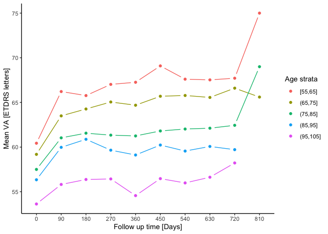
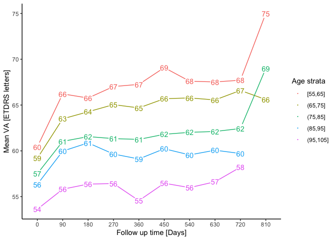

eye
================

<!-- README.md is generated from README.Rmd. Please edit that file -->

See more with *eye*.

*eye* is dedicated to facilitate ophthalmic research.</br> Its core
functions [`blink()`](#blink), [`eyes()`](#eyes), [`myop()`](#myop), and
[`va()`](#va) help with very common tasks:

  - Counting patients and eyes
  - Visual acuity and intraocular pressure: Shape data and analyze\!
  - Conversion of visual acuity notations.

*eye* contains a well curated [real life data set](#amd-data) and some
functions beyond ophtalmology, which could make your data analysis a
tiny bit more convenient.

Finally, eye comes with [`geom_trail()`](#geom_trail) for some nice
trail graphs.

# Features

## Pure ophthalmology

  - [Perceive your data in a blink of an eye](#blink)
  - [Easy count of patients and eyes](#eyes)
  - [Conversion of visual acuity notations](#va)
  - [Make your eye data long](#myop)

### AMD data

  - Anonymised [real life data from a large
    cohort](https://datadryad.org/stash/dataset/doi:10.5061/dryad.97r9289)
    of patients with treatment-naive neovascular age-related macular
    degeneration (AMD) who received intravitreal anti-VEGF therapy in
    Moorfields Eye Hospital, London, UK.
  - To reference this data in your publication, please kindly cite the
    corresponding publication.(Fasler et al. [2019](#ref-fasler))

## Beyond the eye

### Convenience functions:

  - [Insight: get common summary statistics](#insight)
  - [Calculate age](#age)
  - [Conveniently save a data frame to csv](#csv)

### Catch eyes - ggplot2 extensions

  - [geom\_trail: A base plot type = “b” equivalent for
    ggplot2](#geom_trail)

# Install eye

Currently only on github.

``` r
# for the development version 
devtools::install_github("tjebo/eye")
```

# Examples

## Pure eye stuff - core eye functions

### blink

### eyes

Count patient and eyes
[source](https://github.com/tjebo/eye/blob/master/R/eyes.R)

``` r
eyes(amd)
#> Eyes coded 0:1. Interpreting as r = 0
#> patients     eyes    right     left 
#>     3357     3357     1681     1676
```

### va

Visual acuity notation conversion
([source](https://github.com/tjebo/eye/blob/master/R/va.R)). Based on
conversion tables, formulas and findings from (Schulze-Bonsel et al.
[2006](#ref-bach)) and (Gregori, Feuer, and Rosenfeld
[2010](#ref-gregori)).

``` r
# TBC
```

### myop

Make your data long (“myopic”).
[source](https://github.com/tjebo/eye/blob/master/R/myop.R)

``` r
#wide data
iop_wide
#>   id  r  l
#> 1  a 11 14
#> 2  b 13 15
#> 3  c 12 16

# Make it long
iop_long <- myop(iop_wide)
#> Picked "r" and "l" for right and left eyes
#> Neither VA nor IOP column(s) found. Gathering eye columns
iop_long
#> # A tibble: 6 x 3
#>   id    eye   value
#>   <chr> <chr> <int>
#> 1 a     r        11
#> 2 a     l        14
#> 3 b     r        13
#> 4 b     l        15
#> 5 c     r        12
#> 6 c     l        16
```

Often enough, there are right eye / left eye columns for more than one
variable, e.g., for both IOP and VA. `myop` helps you clean this mess.

``` r
messy_df
#>   id iop_r iop_l va_r va_l
#> 1  a    12    13   41   42
#> 2  b    13    12   43   43
#> 3  c    11    11   42   41

#myop will detect IOP and VA columns automatically

clean_df <- myop(messy_df)
#> Picked "iop_r,va_r" and "iop_l,va_l" for right and left eyes
#> Gathering both VA and IOP columns
clean_df
#> # A tibble: 6 x 4
#>   id    eye     IOP    VA
#>   <chr> <chr> <int> <int>
#> 1 a     r        12    41
#> 2 a     l        13    42
#> 3 b     r        13    43
#> 4 b     l        12    43
#> 5 c     r        11    42
#> 6 c     l        11    41
```

## Beyond the eye

### insight

Show common statistics

``` r
amd_unq <- amd[!duplicated(amd$Id),]

insight(amd_unq[c("BaselineAge", "VA_ETDRS_Letters", "FollowupDays")])
#>                  mean   sd    n median min max
#> BaselineAge      78.3  9.1 3357     79  60  99
#> VA_ETDRS_Letters 56.3 14.7 3357     58   0  92
#> FollowupDays      0.1  3.1 3357      0   0 168
```

### age

  - Calculate age in years, as [periods or
    durations](https://lubridate.tidyverse.org/articles/lubridate.html#time-intervals)
  - If only the start date given, calculating the age today.

<!-- end list -->

``` r
age("1984-10-16")
#> [1] 35.6

dob <-  c("1984-10-16", "2000-01-01")
test_date <-  as.Date(dob) + c(15000, 20000)

age(dob, test_date)
#> [1] 41.1 54.8
```

### csv

  - A convenience wrapper around `write.csv`. Saves a .csv file with the
    name of the data frame, or with a different name.

<!-- end list -->

``` r
csv(amd)
```

## ggplot2 extensions

### geom\_trail

A base plot type = “b” equivalent for ggplot. Works also with text\!

``` r
library(ggplot2)
library(dplyr)
# data preparation
amd_aggr <-
  amd %>%
  group_by(
    age_cut10 = cut_width(BaselineAge, 10),
    days_cut90 = cut_width(FollowupDays, 90, labels = seq(0, 810, 90))
  ) %>%
  summarise(mean_va = mean(VA_ETDRS_Letters)) 

# plot
p <-
  ggplot(amd_aggr, aes(days_cut90, mean_va, color = age_cut10)) +
    theme_classic() +
    labs(x = "Follow up time [Days]", y = "Mean VA [ETDRS letters]", color = "Age strata")

p1 <- p + geom_trail(aes(group = age_cut10))

p2 <- p + geom_trail(aes(group = age_cut10), size = 0) +
          geom_text(aes(label = round(mean_va, 0)), show.legend = FALSE)
```

``` r
p1 

p2
```



# Acknowledgements

  - Thanks to Siegfried Wagner and Abraham Olvera, for their help with
    VA conversion
  - Thanks to Tim Yap for helping find typos. All remaining typos are
    entirely his fault.
  - Thanks to Hadley Wickham\! Many of the functions in my package rely
    on the `tidyverse` package, but I would never have been able to make
    this package without his development tools `roxygen2`, `usethis`,
    `testthis` and `devtools`.

# References

<div id="refs" class="references">

<div id="ref-fasler">

Fasler, Katrin, Gabriella Moraes, Siegfried Wagner, Karsten U Kortuem,
Reena Chopra, Livia Faes, Gabriella Preston, et al. 2019. “One- and
Two-Year Visual Outcomes from the Moorfields Age-Related Macular
Degeneration Database: A Retrospective Cohort Study and an Open Science
Resource.” *BMJ Open* 9 (6). British Medical Journal Publishing Group.
<https://doi.org/10.1136/bmjopen-2018-027441>.

</div>

<div id="ref-gregori">

Gregori, Ninel Z, William Feuer, and Philip J Rosenfeld. 2010. “Novel
Method for Analyzing Snellen Visual Acuity Measurements.” *Retina* 30
(7). Ovid Technologies (Wolters Kluwer Health): 1046–50.
<https://doi.org/10.1097/iae.0b013e3181d87e04>.

</div>

<div id="ref-bach">

Schulze-Bonsel, Kilian, Nicolas Feltgen, Hermann Burau, Lutz Hansen, and
Michael Bach. 2006. “Visual Acuities ‘Hand Motion’ and ‘Counting
Fingers’ Can Be Quantified with the Freiburg Visual Acuity Test.”
*Investigative Ophthalmology & Visual Science* 47 (3): 1236–40.
<https://doi.org/10.1167/iovs.05-0981>.

</div>

</div>
