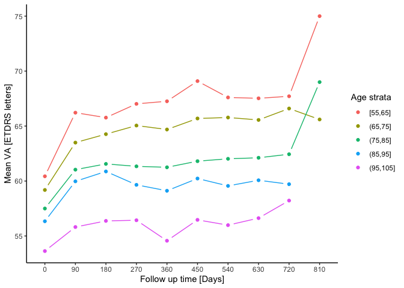

eye
================

<!-- README.md is generated from README.Rmd. Please edit that file -->

<!-- badges: start -->

<!-- badges: end -->

See more with *eye*

## Purpose

*eye* is dedicated to facilitate ophthalmic research. Its functions
[`va()`](#va), [`eyes()`](#eyes), [`myop()`](#myop),
[`blink()`](#blink), [`reveal()`](#reveal) and [`age()`](#age) are
designed to help with common tasks in eye research:

  - Visual acuity conversion for snellen, logMAR and ETDRS
  - Counting patients and eyes
  - Reshape data from wide to long:  
    Often, one variables spreads over two columns for right and left
    eyes. But many functions need the data “long”, with only one column
    for each variable and a separate column for eyes
  - Summarising data with common statistics (mean, sd, n, range)
  - Calculating age of patients

*eye* includes [`amd`](#amd-data), a real life data set of people who
received intravitreal injections due to age-related macular degeneration
in **Moorfields Eye Hospital**. (Fasler et al. [2019](#ref-fasler))

Finally, *eye* also comes with the ggplot2 extension
[`geom_trail()`](#geom_trail) for some nice trail graphs.

## Installation

And the development version from [GitHub](https://github.com/tjebo/eye)
with:

``` r
# install.packages("devtools")
devtools::install_github("tjebo/eye")

library(eye)
```

## Features

### Only eye

  - va: [Conversion of visual acuity notations](#va)
  - eyes: [Easy count of patients and eyes](#eyes)
  - eyestr: [return eye count as text for your report](#eyestr)
  - myop: [Make your eye data long](#myop)
  - blink: [Perceive your data in a blink of an eye](#blink)
  - Visual acuity [conversion chart](#va-conversion)
  - **AMD data**: [Anonymised real life
    data](https://datadryad.org/stash/dataset/doi:10.5061/dryad.97r9289)
    from a large cohort of patients with treatment-naive neovascular
    age-related macular degeneration (AMD) who received intravitreal
    anti-VEGF therapy in Moorfields Eye Hospital, London, UK. </br>
    **Kindly reference this data by citing the corresponding
    publication**. (Fasler et al. [2019](#ref-fasler))

### Beyond eyes

  - reveal: [Get common summary statistics](#reveal)
  - age: [Calculate age](#age)
  - geom\_trail: [A base plot type = “b” equivalent for
    ggplot2](#geom_trail)

## Details and examples

### va

Easy conversion from visual acuity notations in a single call to `va()`:
Automatic detection of VA notation and convert to logMAR by default (but
you can convert to snellen or ETDRS as well). For some more details see
[VA
conversion](#va-conversion)

``` r
## automatic detection of VA notation and converting to logMAR by default
x <- c(23, 56, 74, 58) ## ETDRS letters
va(x)
#> x: from etdrs
#> [1] 1.24 0.58 0.22 0.54

va(x, to = "snellen") ## ... or convert to snellen
#> x: from etdrs
#> [1] "20/320" "20/80"  "20/32"  "20/70"

## A mix of notations, with "plus/minus" entries, and categories 
x <- c("NLP", "0.8", "34", "3/60", "2/200", "20/40+3", "20/50-2")
va(x)
#> Mixed object (x) - converting one by one
#> [1] 3.00 0.80 1.02 1.30 2.00 0.30 0.40

## on the inbuilt data set:
head(va(amd$VA_ETDRS_Letters), 10) 
#> Warning: NA introduced (amd$VA_ETDRS_Letters) - implausible values
#>  [1] 0.82 0.08 0.70 0.90 1.06 1.02 0.96 1.06 0.40 0.46

## and indeed, there are unplausible ETDRS values in this data set:
range(amd$VA_ETDRS_Letters)
#> [1]   0 105
```

### eyes

Count patient and eyes (**eyes** or **eyestr**)

``` r
eyes(amd)
#> Eyes coded 0:1. Interpreting r = 0
#> patients     eyes    right     left 
#>     3357     3357     1681     1676
```

#### eyestr

Same as `eyes`, but as text for reports

``` r
eyestr(amd)
#> [1] "3357 eyes of 3357 patients"
 
 ## Numbers smaller than or equal to 12 will be real English
eyestr(head(amd, 100))
#> [1] "Eleven eyes of eleven patients"
```

### myop

Make your data long (“myopic”)

``` r
## Simple data frame with one column for right eye and left eye.
iop_wide
#>   id iop_r iop_l
#> 1  a    11    14
#> 2  b    13    15
#> 3  c    12    16

myop(iop_wide)
#> # A tibble: 6 x 3
#>   id    eye   iop  
#>   <chr> <chr> <chr>
#> 1 a     r     11   
#> 2 a     l     14   
#> 3 b     r     13   
#> 4 b     l     15   
#> 5 c     r     12   
#> 6 c     l     16
```

Often enough, there are right eye / left eye columns for more than one
variable, e.g., for both IOP and VA. `myop` helps you clean this mess
and will detect those variable columns automatically.

This is an example of such a messy data frame:

<details>

<summary>Click to unfold code to create messy df </summary>

``` r
messy_df <- data.frame(
  id = letters[1:4], 
  surgery_right = c("TE", "TE", "SLT", "SLT"),
  surgery_left = c("TE", "TE", "TE", "SLT"),
  iop_r_preop = 21:24, iop_r_postop = 11:14,
  iop_l_preop = 31:34, iop_l_postop = 11:14, 
  va_r_preop = 41:44, va_r_postop = 45:48,
  va_l_preop = 41:44, va_l_postop = 45:48
)
```

</details>


``` r
clean_df <- myop(messy_df)

clean_df
#> # A tibble: 8 x 7
#>   id    eye   surgery iop_preop iop_postop va_preop va_postop
#>   <chr> <chr> <chr>   <chr>     <chr>      <chr>    <chr>    
#> 1 a     r     TE      21        11         41       45       
#> 2 a     l     TE      31        11         41       45       
#> 3 b     r     TE      22        12         42       46       
#> 4 b     l     TE      32        12         42       46       
#> 5 c     r     SLT     23        13         43       47       
#> 6 c     l     TE      33        13         43       47       
#> 7 d     r     SLT     24        14         44       48       
#> 8 d     l     SLT     34        14         44       48
```

### blink

See your data in a blink of an eye - wrapper around [`myop`](#myop),
[`eyes`](#eyes), [`va`](#va) and [`reveal`](#reveal). It will look for
VA and for IOP columns and provide the summary stats for the entire
cohort and for right and left eyes for each variable.

``` r
blink(messy_df)
#> va_preop: from etdrs
#> va_postop: from etdrs
#> 
#> ── blink ────────────────────────────────────────────────────────────
#> ══ Data ════════════════════════════════
#> # A tibble: 8 x 7
#>   id    eye   surgery iop_preop iop_postop va_preop va_postop
#>   <chr> <chr> <chr>   <chr>     <chr>      <logmar> <logmar> 
#> 1 a     r     TE      21        11         0.88     0.80     
#> 2 a     l     TE      31        11         0.88     0.80     
#> 3 b     r     TE      22        12         0.86     0.78     
#> 4 b     l     TE      32        12         0.86     0.78     
#> 5 c     r     SLT     23        13         0.84     0.76     
#> 6 c     l     TE      33        13         0.84     0.76     
#> 7 d     r     SLT     24        14         0.82     0.74     
#> 8 d     l     SLT     34        14         0.82     0.74     
#> 
#> ══ Count of patient and eyes ═══════════
#> patients     eyes    right     left 
#>        4        8        4        4 
#> 
#> ══ Visual acuity ═══════════════════════
#> 
#> ── $VA_total (all eyes)
#>         var mean sd n min max
#> 1  va_preop  0.8  0 8 0.8 0.9
#> 2 va_postop  0.8  0 8 0.7 0.8
#> 
#> ── $VA_eyes (right and left eyes)
#>   eye       var mean sd n min max
#> 1   l  va_preop  0.8  0 4 0.8 0.9
#> 2   l va_postop  0.8  0 4 0.7 0.8
#> 3   r  va_preop  0.8  0 4 0.8 0.9
#> 4   r va_postop  0.8  0 4 0.7 0.8
#> 
#> ══ Intraocular pressure ════════════════
#> 
#> ── $IOP_total (all eyes)
#>          var mean  sd n min max
#> 1  iop_preop 27.5 5.5 8  21  34
#> 2 iop_postop 12.5 1.2 8  11  14
#> 
#> ── $IOP_eyes (right and left eyes)
#>   eye        var mean  sd n min max
#> 1   l  iop_preop 32.5 1.3 4  31  34
#> 2   l iop_postop 12.5 1.3 4  11  14
#> 3   r  iop_preop 22.5 1.3 4  21  24
#> 4   r iop_postop 12.5 1.3 4  11  14
```

### reveal

Show common statistics for all numeric columns, for the entire cohort or
aggregated by group(s):

``` r
reveal(clean_df)
#>          var mean  sd n min max
#> 1  iop_preop 27.5 5.5 8  21  34
#> 2 iop_postop 12.5 1.2 8  11  14
#> 3   va_preop 42.5 1.2 8  41  44
#> 4  va_postop 46.5 1.2 8  45  48

reveal(clean_df, by = "eye")
#>   eye        var mean  sd n min max
#> 1   l  iop_preop 32.5 1.3 4  31  34
#> 2   l iop_postop 12.5 1.3 4  11  14
#> 3   l   va_preop 42.5 1.3 4  41  44
#> 4   l  va_postop 46.5 1.3 4  45  48
#> 5   r  iop_preop 22.5 1.3 4  21  24
#> 6   r iop_postop 12.5 1.3 4  11  14
#> 7   r   va_preop 42.5 1.3 4  41  44
#> 8   r  va_postop 46.5 1.3 4  45  48

reveal(clean_df, by = c("eye", "surgery"))
#>    eye surgery        var mean  sd n min max
#> 1    l     SLT  iop_preop 34.0  NA 1  34  34
#> 2    l     SLT iop_postop 14.0  NA 1  14  14
#> 3    l     SLT   va_preop 44.0  NA 1  44  44
#> 4    l     SLT  va_postop 48.0  NA 1  48  48
#> 5    r     SLT  iop_preop 23.5 0.7 2  23  24
#> 6    r     SLT iop_postop 13.5 0.7 2  13  14
#> 7    r     SLT   va_preop 43.5 0.7 2  43  44
#> 8    r     SLT  va_postop 47.5 0.7 2  47  48
#> 9    l      TE  iop_preop 32.0 1.0 3  31  33
#> 10   l      TE iop_postop 12.0 1.0 3  11  13
#> 11   l      TE   va_preop 42.0 1.0 3  41  43
#> 12   l      TE  va_postop 46.0 1.0 3  45  47
#> 13   r      TE  iop_preop 21.5 0.7 2  21  22
#> 14   r      TE iop_postop 11.5 0.7 2  11  12
#> 15   r      TE   va_preop 41.5 0.7 2  41  42
#> 16   r      TE  va_postop 45.5 0.7 2  45  46
```

### age

  - Calculate age in years, as [periods or
    durations](https://lubridate.tidyverse.org/articles/lubridate.html#time-intervals)

<!-- end list -->

``` r
dob <- c("1984-10-16", "2000-01-01")

## If no second date given, the age today
age(dob)
#> [1] 35.6 20.4
age(dob, "2000-01-01")                                                    
#> [1] 15.2  0.0
```

### geom\_trail

A base plot type = “b” equivalent for ggplot. Works also with text\!

<details>

<summary>Prepare AMD data for plot (click to unfold) </summary>

``` r
library(tidyverse)
amd_aggr <-
  amd %>%
  group_by(
    age_cut10 = cut_width(BaselineAge, 10),
    days_cut90 = cut_width(FollowupDays, 90, labels = seq(0, 810, 90))
  ) %>%
  summarise(mean_va = mean(VA_ETDRS_Letters)) %>%
  filter(as.integer(days_cut90) <= 9)
```

</details>

``` r
p <-
  ggplot(amd_aggr, aes(days_cut90, mean_va, color = age_cut10)) + 
  scale_color_brewer(palette = "Set1") +
  theme_classic() +
  labs(
    x = "Follow up time [binned by 90 days]", y = "Mean VA [ETDRS letters]",
    color = "Age strata"
  )
```

    p + geom_trail(aes(group = age_cut10))
    
    p + geom_trail(aes(group = age_cut10), size = 0) +
        geom_text(aes(label = round(mean_va, 0)), show.legend = FALSE)



## Column names and codes

**eye works smoother with clean data** (any package does, really\!) -
[Learn about clean
data.](https://tidyr.tidyverse.org/articles/tidy-data.html)

### Tips and rules for naming:

1)  Don’t be too creative with your names\!
2)  Use common coding:

<!-- end list -->

  - **eyes**: “r”, “re”, “od”, “right” - or numeric coding r:l = 0:1 or
    1:2
  - **Visual acuity**: “VA”, “BCVA”, “Acuity”
  - **Intraocular pressure**: “IOP”, “GAT”, “NCT”, “pressure”
  - **Patient identifier**: “pat”, “patient”, “ID” (ideally both:
    “patientID” or “patID”)

<!-- end list -->

3)  Column names:

<!-- end list -->

  - No spaces\!
  - Do not use numeric coding for eyes in column names
  - Separate eye and VA and IOP codes with underscores
    (“bcva\_l\_preop”, “VA\_r”, “left\_va”, “IOP\_re”)
  - Keep names short
  - Don’t use underscores when you don’t need to: Consider each section
    divided by an underscore as a relevant characteristic of your
    variable. E.g., “preop” instead of “pre\_op”, or simply “VA” instead
    of “VA\_ETDRS\_Letters”

### Name examples

Good names (`eye` will work nicely)

``` r
## right and left eyes have common codes
## information on the tested dimension is included ("iop")
## VA and eye strings are separated by underscores
## No unnecessary underscores.
names(messy_df)
#>  [1] "id"            "surgery_right" "surgery_left"  "iop_r_preop"  
#>  [5] "iop_r_postop"  "iop_l_preop"   "iop_l_postop"  "va_r_preop"   
#>  [9] "va_r_postop"   "va_l_preop"    "va_l_postop"

names(iop_wide) 
#> [1] "id"    "iop_r" "iop_l"
```

OK names (`eye` will work)

``` r
## Id and Eye are common names, there are no spaces
## VA is separated from the rest with an underscore
## BUT: 
## The names are quite long 
## There is an unnecessary underscore (etdrs are always letters). Better just "VA"
names(amd) 
#> [1] "Id"               "Eye"              "FollowupDays"     "BaselineAge"     
#> [5] "Gender"           "VA_ETDRS_Letters" "InjectionNumber"

## All names are commonly used (good!)
## But which dimension of "r"/"l" are we exactly looking at? 
c("id", "r",  "l")
#> [1] "id" "r"  "l"
```

Bad names (`eye` will fail)

``` r
## VA/IOP not separated with underscore
## `eye` won't be able to recognize IOP and VA columns
c("id", "iopr", "iopl", "VAr", "VAl")
#> [1] "id"   "iopr" "iopl" "VAr"  "VAl"

## A human may think this is clear
## But `eye` will fail to understand those variable names
c("person", "goldmann", "vision")
#> [1] "person"   "goldmann" "vision"

## Not even clear to humans
c("var1", "var2", "var3")
#> [1] "var1" "var2" "var3"
```

## Important notes

**I do not assume responsability for your data or analysis**. Please
always keep a critical mind when working with data - if you do get
results that seem implausible, there may be a chance that the data is in
an unfortunate shape for which `eye` may not be suitable.

## VA conversion

  - VA conversion between Snellen, ETDRS and logMAR is based on charts
    and formulas in (Holladay [2004](#ref-holladay)), (Beck et al.
    [2003](#ref-beck)) and (Gregori, Feuer, and Rosenfeld
    [2010](#ref-gregori))
  - Categories **counting fingers** and **hand movements** are converted
    following (Schulze-Bonsel et al. [2006](#ref-bach))
  - Categories **(no) light perception** are converted following the
    suggestions by Michael Bach

### VA conversion chart

This chart is included in the package
(`va_chart`)

<div style="font-size:8 pt;">

| Snellen feet | Snellen meter | Snellen decimal | logMAR | ETDRS | Categories |
| ------------ | ------------- | --------------- | ------ | ----- | ---------- |
| 20/20000     | 6/6000        | 0.001           | 3      | 0     | NLP        |
| 20/10000     | 6/3000        | 0.002           | 2.7    | 0     | LP         |
| 20/4000      | 6/1200        | 0.005           | 2.3    | 0     | HM         |
| 20/2000      | 6/600         | 0.01            | 1.9    | 2     | CF         |
| 20/800       | 6/240         | 0.025           | 1.6    | 5     | NA         |
| 20/630       | 6/190         | 0.032           | 1.5    | 10    | NA         |
| 20/500       | 6/150         | 0.04            | 1.4    | 15    | NA         |
| 20/400       | 6/120         | 0.05            | 1.3    | 20    | NA         |
| 20/320       | 6/96          | 0.062           | 1.2    | 25    | NA         |
| 20/300       | 6/90          | 0.067           | 1.18   | 26    | NA         |
| 20/250       | 6/75          | 0.08            | 1.1    | 30    | NA         |
| 20/200       | 6/60          | 0.1             | 1.0    | 35    | NA         |
| 20/160       | 6/48          | 0.125           | 0.9    | 40    | NA         |
| 20/125       | 6/38          | 0.16            | 0.8    | 45    | NA         |
| 20/120       | 6/36          | 0.167           | 0.78   | 46    | NA         |
| 20/100       | 6/30          | 0.2             | 0.7    | 50    | NA         |
| 20/80        | 6/24          | 0.25            | 0.6    | 55    | NA         |
| 20/70        | 6/21          | 0.29            | 0.54   | 58    | NA         |
| 20/63        | 6/19          | 0.32            | 0.5    | 60    | NA         |
| 20/60        | 6/18          | 0.33            | 0.48   | 61    | NA         |
| 20/50        | 6/15          | 0.4             | 0.4    | 65    | NA         |
| 20/40        | 6/12          | 0.5             | 0.3    | 70    | NA         |
| 20/32        | 6/9.6         | 0.625           | 0.2    | 75    | NA         |
| 20/30        | 6/9           | 0.66            | 0.18   | 76    | NA         |
| 20/25        | 6/7.5         | 0.8             | 0.1    | 80    | NA         |
| 20/20        | 6/6           | 1.0             | 0.0    | 85    | NA         |
| 20/16        | 6/5           | 1.25            | \-0.1  | 90    | NA         |
| 20/15        | 6/4.5         | 1.33            | \-0.12 | 91    | NA         |
| 20/13        | 6/4           | 1.5             | \-0.2  | 95    | NA         |
| 20/10        | 6/3           | 2.0             | \-0.3  | 100   | NA         |

</div>

## Acknowledgements

  - Thanks to **Alasdair Warwick** for both invaluable suggestions and
    testing, **Tim Yap** and **Siegfried Wagner** for great suggestions
    and **Abraham Olvera** for testing.
  - Thanks to Hadley Wickham and all developers of the `tidyverse`
    packages and the packages `roxygen2`, `usethis`, `testthis` and
    `devtools`, all on which `eye` heavily relies.

## Resources

  - [Michael Bach’s homepage](https://michaelbach.de/sci/acuity.html)
  - [Michael Bach on NLP and
    LP](https://michaelbach.de/sci/pubs/Bach2007IOVS%20eLetter%20FrACT.pdf)

## References

<div id="refs" class="references">

<div id="ref-beck">

Beck, Roy W, Pamela S Moke, Andrew H Turpin, Frederick L Ferris, John
Paul SanGiovanni, Chris A Johnson, Eileen E Birch, et al. 2003. “A
Computerized Method of Visual Acuity Testing.” *American Journal of
Ophthalmology* 135 (2). Elsevier BV: 194–205.
<https://doi.org/10.1016/s0002-9394(02)01825-1>.

</div>

<div id="ref-fasler">

Fasler, Katrin, Gabriella Moraes, Siegfried Wagner, Karsten U Kortuem,
Reena Chopra, Livia Faes, Gabriella Preston, et al. 2019. “One- and
Two-Year Visual Outcomes from the Moorfields Age-Related Macular
Degeneration Database: A Retrospective Cohort Study and an Open Science
Resource.” *BMJ Open* 9 (6). British Medical Journal Publishing Group.
<https://doi.org/10.1136/bmjopen-2018-027441>.

</div>

<div id="ref-gregori">

Gregori, Ninel Z, William Feuer, and Philip J Rosenfeld. 2010. “Novel
Method for Analyzing Snellen Visual Acuity Measurements.” *Retina* 30
(7). Ovid Technologies (Wolters Kluwer Health): 1046–50.
<https://doi.org/10.1097/iae.0b013e3181d87e04>.

</div>

<div id="ref-holladay">

Holladay, Jack T. 2004. “Visual Acuity Measurements.” *Journal of
Cataract and Refractive Surgery* 30 (2): 287–90.
<https://doi.org/10.1016/j.jcrs.2004.01.014>.

</div>

<div id="ref-bach">

Schulze-Bonsel, Kilian, Nicolas Feltgen, Hermann Burau, Lutz Hansen, and
Michael Bach. 2006. “Visual Acuities ‘Hand Motion’ and ‘Counting
Fingers’ Can Be Quantified with the Freiburg Visual Acuity Test.”
*Investigative Ophthalmology & Visual Science* 47 (3): 1236–40.
<https://doi.org/10.1167/iovs.05-0981>.

</div>

</div>
